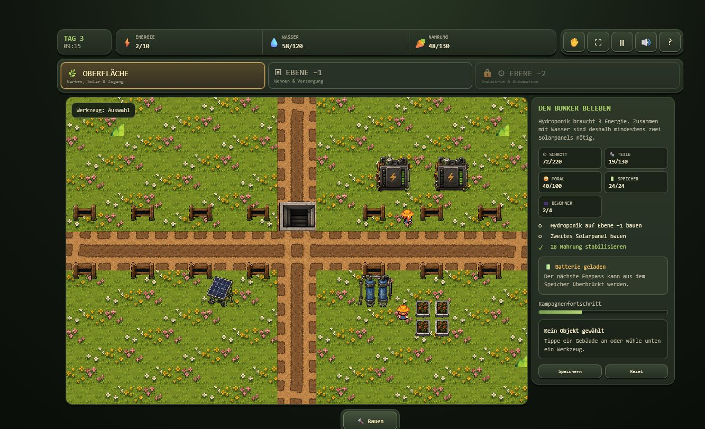
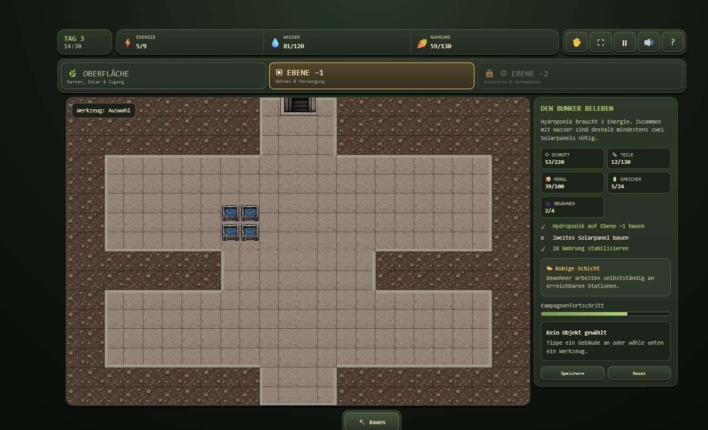

# Cozy Bunker

Cozy Bunker ist ein früher, spielbarer Browser-Prototyp für ein ruhiges
Aufbau- und Ressourcenmanagement-Spiel in Pixeloptik. Auf der Oberfläche
entstehen Energie-, Wasser- und Nahrungsversorgung; anschließend wird der
Bunker Ebene für Ebene ausgebaut.

Der aktuelle Stand ist eine kompakte „Vertical Slice“ und noch kein fertiges
Spiel. Er zeigt den grundlegenden Spielfluss, das Baugefühl, die
Ressourcenabhängigkeiten und die visuelle Richtung. Balancing, Umfang,
Langzeitmotivation und Feinschliff sind noch in Arbeit.

## Aktueller Spieleindruck

### Oberfläche

Solarpanels, Batterien, Wasseranlage und Garten bilden die erste
Versorgungskette. Gebäude werden nicht fertig vorgegeben, sondern im Verlauf
der Einführung freigeschaltet und vom Spieler platziert.



### Ebene −1

Die erste Untergrundebene startet weitgehend leer. Hier baut der Spieler die
Wohn- und Versorgungsräume selbst auf. Das Bild zeigt den frühen Ausbau mit
dem ersten Hydroponik-Modul – nicht eine künstlich gefüllte Präsentationskarte.



## Was bereits spielbar ist

- Geführter Einstieg mit nacheinander freigeschalteten Bauwerken und Zielen
- Oberfläche, Versorgungsebene −1 und Industrieausbau auf Ebene −2
- Bauen, Entfernen und schrittweises Ausheben des Untergrunds
- Ressourcen: Energie, Wasser, Nahrung, Schrott, Teile und Moral
- Tagesabhängige Solarproduktion sowie Laden und Entladen von Batterien
- Energieverbraucher mit Ein/Aus-Schaltung und Prioritäten
- Bauzeiten, Bewohnerbewegung, kleine Ereignisse und Entscheidungen
- Lokaler Spielstand im Browser
- Responsive HUD, Vollbild und eigener Ansichtsmodus für die Kamera
- Maus-, Tast-/Touch- und Pinch-Zoom-Bedienung
- Umgebungs- und UI-Sounds

## Spielen

Es gibt derzeit keinen Build-Schritt. Im Repository genügt ein einfacher
lokaler Webserver:

```bash
python -m http.server 8000
```

Danach `http://127.0.0.1:8000/index.html` im Browser öffnen.

Phaser, Howler.js und EasyStar.js werden über CDNs geladen. Für den ersten
Start ist daher eine Internetverbindung erforderlich.

## Bedienung

- **Bauen:** Unten „Bauen“ öffnen, ein Werkzeug wählen und auf eine gültige
  Kachel klicken oder tippen.
- **Objekte verwalten:** Ein gebautes Objekt auswählen, um Status,
  Energiepriorität und Ein/Aus-Zustand zu ändern.
- **Kamera:** Den Hand-/Ansichtsbutton aktivieren. Mit der Maus oder einem
  Finger ziehen; mit Mausrad oder Zwei-Finger-Geste zoomen.
- **Vollbild:** Über den Vollbildbutton im oberen HUD.
- **Speichern:** Automatisch sowie manuell über die Seitenleiste. Der
  Spielstand liegt nur im lokalen Browser.

## Technik

Der Prototyp besteht bewusst aus einer einzelnen `index.html` und verwendet:

- Phaser 3.90 für Rendering und Eingabe
- EasyStar.js für Wegfindung
- Howler.js für Audio
- Pixelart-Atlanten und eingebettete Audio-/Grafikdaten

Eine Paketinstallation, ein Backend oder ein Benutzerkonto sind aktuell nicht
notwendig.

## Ehrlicher Projektstatus

Cozy Bunker ist momentan gut genug, um den Kernloop einige Minuten zu testen
und die Richtung zu beurteilen. Es fehlen noch deutlich mehr Inhalte,
langfristige Ziele, sorgfältiges Balancing, umfangreiche Tests,
Barrierefreiheitsarbeit und finaler visueller sowie akustischer Feinschliff.
Der Code ist prototypisch und noch nicht in eine langfristig wartbare
Projektstruktur aufgeteilt.

Die Screenshots oben stammen direkt aus dem laufenden Prototyp und zeigen
einen realen frühen Spielstand.

## Assets und Lizenzen

Figuren und Pflanzen stammen aus **SuperRetroRanch Free Tier v32** von Gif.
Die mitgelieferte Free-Tier-Lizenz erlaubt nur nichtkommerzielle Nutzung.
Terrain, Bunkerobjekte und Maschinen stammen aus dem im Repository
normalisierten Bunker Asset Pack v1. Phaser, EasyStar.js und Howler.js stehen
unter der MIT-Lizenz.

Weitere technische Hinweise befinden sich in
[`docs/ASSET_RULES.md`](docs/ASSET_RULES.md) und
[`docs/SOURCE_NOTES.md`](docs/SOURCE_NOTES.md).
